# 개발에도 최최최종 파일이 있다고요?

## 유의사항

본 글은 한국외국어대학교 Google Developer Student Clubs (GDSC) 2022년 정기세션 활동을 위해 작성된 가이드 글입니다.

해당 글을 통해 깃과 깃헙의 개념, 그리고 사용 방법에 대해 익힐 수 있습니다.

깃이 이미 설치되어 있고 깃헙에 가입을 했다는 것을 바탕으로 진행되는 글이기 때문에 깃 설치 및 깃헙 가입 방법에 대해서는 다른 글을 참고해주시기 바랍니다.

추가적으로 모든 파일 실행 환경은 맥(Mac) 기준이며 통합 개발 환경(Integrated Development Environment, IDE) 또한 비주얼 스튜디오 코드(Visual Studio Code, VSC)를 기준으로 합니다.

## 목차

- [1. 최종이가 너무 많아요.](#1-최종이가-너무-많아요)
  - [1.1. _제발진짜최종.ppt_ 파일이 최종 제출본이에요.](#11-제발진짜최종ppt-파일이-최종-제출본이에요)
  - [1.2. 깃이라는게 있어요.](#12-깃이라는게-있어요)
  - [1.3. 깃헙이라는 것도 있어요.](#13-깃헙이라는-것도-있어요)
- [2. 일단 시작해봐요.](#2-일단-시작해봐요)
  - [2.1. 콕 찝어서 가져와요.](#21-콕-찝어서-가져와요)
  - [2.2. 첫 번째 디렉토리를 생성해봐요.](#22-첫-번째-디렉토리를-생성해봐요)
  - [2.3. 두 번째 디렉토리를 생성해봐요.](#23-두-번째-디렉토리를-생성해봐요)
- [3. 무언가 남겨봐요.](#3-무언가-남겨봐요)
  - [3.1. 무대에 올라가 내가 한 것들을 뽐내요.](#31-무대에-올라가-내가-한-것들을-뽐내요)
  - [3.2. 밀고 당기는 관계에요.](#32-밀고-당기는-관계에요)
- [4. 함께 작업해봐요.](#4-함께-작업해봐요)
  - [4.1. 나무는 가지를 뻗으면서 커가요.](#41-나무는-가지를-뻗으면서-커가요)
  - [4.2. 두 번째 가지를 뻗어봐요.](#42-두-번째-가지를-뻗어봐요)
  - [4.3. 작업을 하다 말았어요.](#43-작업을-하다-말았어요)
  - [4.4. 어느 것을 고를까요.](#44-어느-것을-고를까요)
- [5. 함께 더 잘 일해보고 싶어요.](#5-함께-더-잘-일해보고-싶어요)
  - [5.1. 중요한 파일은 못 올리게 해요.](#51-중요한-파일은-못-올리게-해요)
  - [5.2. 너무 많은 사람이 같이 일해요.](#52-너무-많은-사람이-같이-일해요)
  - [5.3. 엔지니어들은 게을러요.](#53-엔지니어들은-게을러요)
- [6. 결론](#6-결론)

### 1. 최종이가 너무 많아요

#### 1.1. _제발진짜최종.ppt_ 파일이 최종 제출본이에요.

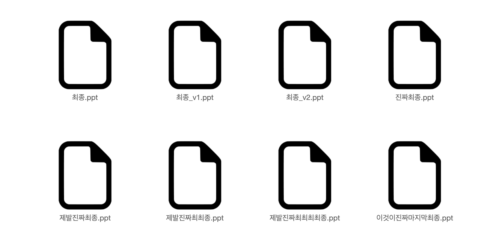

학교 과제를 하거나 일을 할 때 분명 끝난 것 같은데 파일을 다시 수정하거나 보완해본 경험이 있으신가요?

분명 다 끝난다며 `최종.ppt` 파일을 만들었는데 또 수정해야 할 게 생겨 `최종_v1.ppt` 파일을 만들고 다시 `진짜최종.ppt` 파일을 만들고 또 `제발진짜최종.ppt` 파일을 만들며 쌓여가는 **최종이**를 바라본 경험을 다들 한 번쯤은 해보셨으리라 생각합니다.

그렇다면 왜 **최종이**를 만들었을까요?

보통 혹시나 원본 파일을 날려버릴까봐 혹은 혹시나 이전 수정한 작업에서 다시 추가해야 할 게 생길까봐 여러 **버전**의 최종이를 쌓아두게 됩니다.

이를 조금 간략하게 이야기하면 바로 **버전 관리**라 할 수 있습니다.

그렇다면 프로그래밍 세계에서는 어떨까요?

#### 1.2. 깃이라는게 있어요.

프로그래밍 세계에서는 **깃(Git)** 이라는게 있습니다.

깃은 앞서 이야기했던 버전 관리를 도와주는 시스템으로 이를 멋지게 이야기하면 **버전 관리 시스템(Version Control System, VSC)** 이라 합니다.

어렵게 생각하실 필요 없이 단어 그대로 버전들을, 다시 말해 `최종_v1` 과 `최종_v2` 를 관리해주는 서비스입니다.

어떻게 관리를 해주냐고요?

마치 사진을 찍듯 스냅샷(Snapshot)을 통해 저장해두고자 하는 딱 그 시점을 저장해두고 관리하는 개념입니다.

말이 조금 어렵죠?

깃에는 **커밋(Commit)** 이라는 개념이 있습니다.

아래에서 금방 실습을 해보겠지만 이 개념만 한 번 이해를 해보고 갑시다.

깃 커밋이 무엇인지 용어에 대한 설명을 인터넷에 검색해보면 보통 아래와 같이 뜹니다.

> 프로젝트의 최근 단계적 변경 사항에 대한 스냅샷을 저장한다.

이야기한 스냅샷이란 단어가 나오죠?

그런데 사실 여기서 중요하고 우리가 기억해야 할 건 딱 아래와 같은 단순한 문장입니다.

> 변경 사항을 저장한다.

커밋이라는 영단어를 네이버 영어 사전에 검색해보면 아래와 같이 결과가 나옵니다.

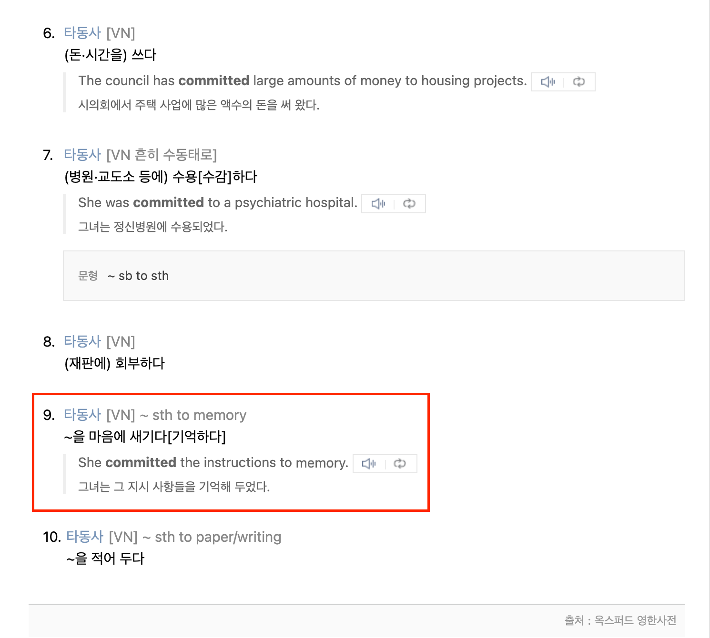

_~을 마음에 새기다[기억하다]_ 라는 뜻이 보이시나요?

깃에서의 커밋의 의미가 사전적 정의와 같이 바로 **기억**입니다.

#### 1.3. 깃헙이라는 것도 있어요.

그런데 문득 이런 의문이 들 수 있습니다.

아니 나 혼자 일하는 것들도 아니고 다른 사람들이랑 함께 일해야 하는데 서로 어떻게 공유하지?

내가 여기까지 작업해서 저장해뒀다고 이걸 다른 사람들에게 어떻게 알리지?

이를 위해 등장한게 바로 **깃헙(GitHub)** 입니다.

깃헙은 소스 코드를 관리해주는 호스팅 플랫폼입니다.

쉽게 말해 깃이 소스 코드의 버전을 관리해주는 시스템이면 깃헙은 이 시스템을 다른 사람과 공유하면서 사용할 수 있게 해주는 호스팅 역할을 해주는 겁니다.

아직 뭔가 추상적이라고요?

쉽게 깃은 카메라, 깃헙은 인스타그램이라 생각하면 편합니다.

우리는 휴대폰에 있는 카메라를 사용해서 마치 _스냅샷_ 을 찍듯 여러 사진을 촬영하고 이를 다른 사람과 공유하고 싶으면 인스타그램 같은 소셜 네트워크 서비스에 업로드를 합니다.

깃과 깃헙이 이런 카메라와 인스타그램 같은 관계입니다.

물론 인스타그램 외에도 페이스북, 트위터, 카카오스토리 등 다양한 소셜 네트워크 서비스가 존재하는 것처럼 깃을 활용한 호스팅 플랫폼도 깃헙만 존재하는게 아닙니다.

하지만 우리는 오늘 보통 프로젝트를 진행할 때 깃헙을 많이 사용하기에 깃헙을 사용해보겠습니다.

### 2. 일단 시작해봐요.

#### 2.1. 콕 찝어서 가져와요.

본인이 직접 함께 공유하려고 하는 곳을 만들 수도 있지만 다른 사람들이 만든 걸 가져다 쓸 수도 있습니다.

우리는 다른 사람들과 함께 작업을 하고 싶기 때문에 이번에는 **포크(Fork)** 라는 개념을 통해 다른 사람이 만든 걸 가져와봅시다.

포크라는 단어에서 알 수 있듯 콕 찝어서 가져오기만 하면 됩니다.

이때 앞서 **곳**이라고 언급한, 다시 말해 여러 사람들의 소스 코드의 버전들이 저장되는 **장소**를 깃헙에서는 **저장소(Repository)** 라 합니다.

먼저 접속한 이곳에서 아래 이미지처럼 우측 상단에 있는 **Fork** 버튼을 클릭합니다.

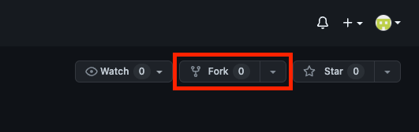

이후 아래 이미지와 같은 화면이 등장할 것 입니다.

타인의 저장소를 내 보금자리로 가져오지만 저장소 이름이나 설명 등은 본인이 원하는 대로 설정할 수 있습니다.

이번 시간에는 그렇게 중요한 내용이 아니기 때문에 우선 아래 있는 **Create fork** 버튼을 클릭하여 진행합시다.

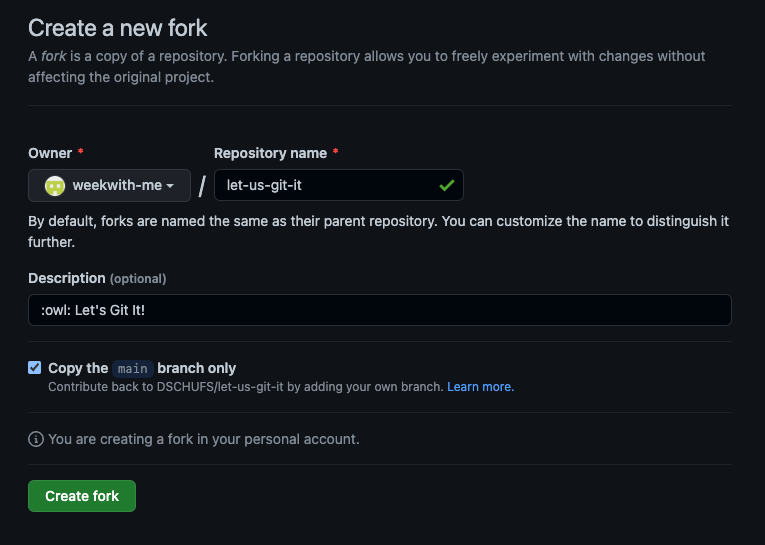

성공적으로 포크를 완료했습니다!

이제 여기서 기억해야 할 건 초록색 **Code** 버튼을 누르면 나오는 주소입니다.

`https://github.com/DSCHUFS/let-us-git-it.git` 이 주소를 복사하여 기억해둡시다.

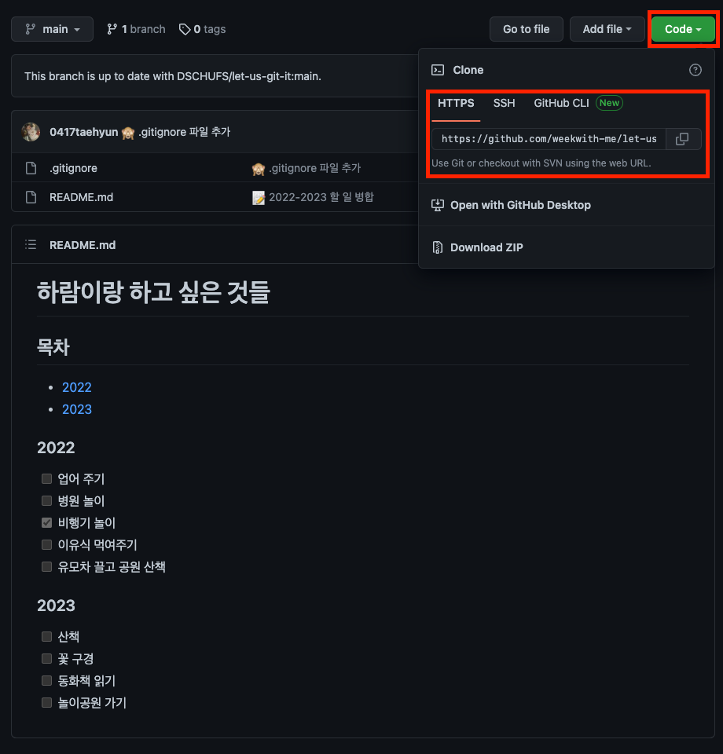

이제 깃헙을 통해 알게 된 타인의 소스 코드 작업들을 내 컴퓨터에 옮기려 합니다.

이를 위해 두 개의 디렉토리를 생성해서 각각 다른 방식을 사용해보려 합니다.

첫 번째 디렉토리의 이름을 `01` , 두 번째 디렉토리의 이름을 `02` 로 지어봅시다.

물론 원하신다면 디렉토리 이름은 아무렇게나 지어도 상관 없습니다.

#### 2.2. 첫 번째 디렉토리를 생성해봐요.

아래 명령어를 하나씩 따라해봅시다.

현재 내 위치에 저장되어 있는 파일 및 디렉토리를 확인하는 명령어가 바로 `ls` 입니다.

이후 `mkdir __directory_name__` 명령어는 _make directory_ 의 줄임말로 말 그대로 디렉토리를 생성하는 명령어입니다.

이후 _change directory_ 의 줄임말인 `cd __directory_name__` 명령어를 통해 생성한 해당 디렉토리로 이동해봅시다.

```Bash
$ ls

$ mkdir 01
$ cd 01
```

첫 번째로 `git clone __remote_repository_uri__` 명령어를 활용하여 우리가 포크한 저장소를 컴퓨터에 생성해봅시다.

앞서 초록색 **Code** 버튼을 클릭해서 기억했던 주소를 `__remote_repository_uri__` 부분에 붙이면 됩니다.

이후 `ls -al` 명령어를 통해 숨겨진 파일까지 한 번에 다 보일 수 있게 해봅시다.

```Bash
$ git clone https://github.com/DSCHUFS/let-us-git-it.git

$ ls -al
```

마지막 `ls -al` 명령어를 사용하면 아래와 같이 `.git` 이라는 디렉토리가 하나 생성된 것을 확인할 수 있습니다.

깃은 이 `.git` 디렉토리를 활용해서 우리가 작업한 내용들을 저장하고 불러올 수 있게 됩니다.

```
drwxr-xr-x@  8  256  9 26 03:13 .
drwxr-xr-x@  3   96  9 26 03:13 ..
drwxr-xr-x@ 14  448  9 26 02:21 .git
-rw-r--r--   1   19  9 26 02:07 .gitignore
-rw-r--r--   1 9620  9 26 03:13 GUIDE.md
drwxr-xr-x@  9  288  9 26 02:58 Images
-rw-r--r--   1  383  9 26 03:10 README.md
```

#### 2.3. 두 번째 디렉토리를 생성해봐요.

다음으로 `git init` 및 `git remote add __remote_repository_name__ __remote_repository_uri__` 명령어를 활용한 방법입니다.

`cd ..` 명령어를 통해 기존 `01` 디렉토리에 있던 위치를 앞선 디렉토리로 이동하고 앞에서 한 것과 동일한 방식으로 `02` 디렉토리를 생성하여 그곳으로 이동해봅시다.

이후 `ls -al` 명령어를 통해 이곳에 존재하는 파일 및 디렉토리 전체를 확인해봅시다.

```Bash
$ cd ..

$ mkdir 02
$ cd 02

$ ls -al
```

`ls -al` 명령어를 사용한 결과 아무것도 나오지 않는 것을 알 수 있습니다.

그러면 다음으로 `git init` 을 활용하여 `.git` 디렉토리를 생성하고 `ls -al` 명령어를 통해 제대로 생성되었는지 확인해봅시다.

이후 `git remote add origin https://github.com/DSCHUFS/let-us-git-it.git` 명령어를 입력하여 `origin` 이라는 이름으로 우리가 앞서 기억했던 저장소의 주소를 저장합시다.

끝으로 `git remote` 명령어에 `-v` 옵션을 활용해서 현재의 저장소 이름과 주소를 알 수 있습니다.

```Bash
$ git init
$ ls -al

$ git remote add origin https://github.com/DSCHUFS/let-us-git-it.git
$ git remote -v
```

이때 `origin` 이라는 표현은 관례입니다.

원하신다면 다른 이름으로 해도 무관합니다.

여기서 중요한 점은 우리가 깃헙이라는 호스팅 플랫폼에 업로드되어 있던 저장소를 `git remote` 명령어를 활용해서 연결시켰듯 **원격 저장소(Remote Repository)** 라 하며 현재 내 컴퓨터에 저장된 소스 코드들과 이 저장소를 **지역 저장소(Local Repository)** 라 한다는 점입니다.

내 컴퓨터에 있으니까 _로컬_ , 내가 아닌 남의 서비스에 올라와져 있으니까 _리무트_ 라 생각하면 편합니다.

여기까지 아주 고생 많으셨습니다!

우리는 작업을 할 준비를 마쳤습니다.

앞으로 만드신 로컬 저장소 `01` 과 `02` 중에서 어떤 저장소를 선택하셔도 상관 없습니다.

그러면 이제 실제로 무언가 남겨보고 공유해볼까요?

### 3. 무언가 남겨봐요.

#### 3.1. 무대에 올라가 내가 한 것들을 뽐내요.

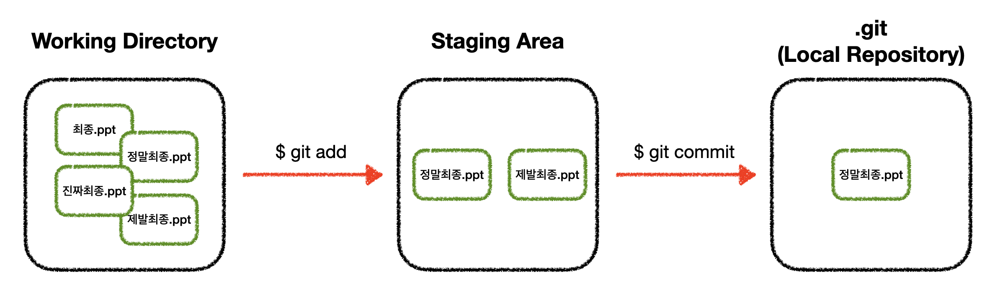

기본적으로 내 컴퓨터에서 깃을 사용하면 위와 같은 단계를 거쳐 내 작업물을, 다시 말해 지금의 버전을 저장할 수 있습니다.

내가 작업하고 있는 디렉토리에서 `git add` 명령어를 활용해 뒤에 스테이징 영역(Staging Area)에 올리고 싶은 파일들을 선택하고 이후 `git commit` 명령어를 활용해 우리가 앞서 살펴봤던 `.git` 디렉토리에 해당 내용을 저장시킵니다.

그러면 왜 스테이징 영역이라는 중간 과정을 거치는 걸까요?

쉽게 생산성을 위해서입니다.

스테이징 영역이 존재하지 않는다면 어떤 것을 커밋해야 할지 고민한 뒤에 바로 커밋을 하게 되고 깃 입장에서는 매번 변화가 있는 파일이 무엇인지 전체를 살펴본 뒤에 작업을 수행해야 합니다.

매번 모든 파일을 탐색한다는 건 비효율적입니다.

스테이징 영역이 있다면 반대로 커밋 예정인 파일들을 스테이징 영역에 올린 뒤에 커밋은 이 부분만 확인해서 작업을 수행하게 됩니다.

훨씬 생산적이고 효율적이게 되는 것이죠.

이밖에도 다양한 이유가 있을 수 있는데 관련해서는 더 찾아보시길 추천합니다.

그러면 이제 이를 한 번 실습해볼까요?

우선 [README.md](./README.md) 파일에서 2022년도에 하람이와 할 일을 몇 가지 추가해봅시다.

(하람이는 제 조카입니다 :smile: )

다음으로 `git status` 명령어를 통해 현재 변화가 일어난 파일이 있는지 단어 그대로 상태(Status)를 확인한 뒤 `git add README.md` 명령어를 통해 우리가 2022년도에 하람이와 할 일을 추가한 버전을 스테이징 영역에 올립시다.

이때 `git add .` 명령어를 사용해도 됩니다.

차이점은 `git add` 명령어 뒤에 `.` 을 붙이면 전체를 의미해서 특정 파일만 스테이징 영역에 올리는 것이 아닌 변화가 있는 모든 파일을 올립니다.

```Bash
$ git status

$ git add README.md # 또는 git add .
```

다음으로 `git log` 명령어를 통해 현재 우리가 작업한 내역이 어떤 내역(Log)으로 남았는지 확인해봅시다.

```Bash
$ git log
```

그러면 아래와 같이 이전 작업들만 기록이 되어있고 여러분이 작업한 내용은 반영되어 있지 않은 것을 알 수 있습니다.

```
commit 3522ed6abaabb11dc25fdce5492465e36a9c2ccd (HEAD -> main, origin/main)
Author: 0417taehyun <0417taehyun@gmail.com>
Date:   Mon Sep 26 02:08:03 2022 +0900

    :see_no_evil: .gitignore 파일 추가

commit 3881e55e4bd29a266e3b7e26a038519fa69930a5 (2023, 2022)
Merge: 771fd47 88b63ad
Author: weekwith.me <63915557+0417taehyun@users.noreply.github.com>
Date:   Mon Sep 26 02:06:02 2022 +0900

    Merge pull request #3 from DSCHUFS/2022

    :memo: 2022-2023 할 일 병합

commit 88b63ad5e71904f9541430cb233128c366f924cd (origin/2022)
Author: 0417taehyun <0417taehyun@gmail.com>
Date:   Mon Sep 26 02:05:17 2022 +0900

    :memo: 2022-2023 할 일 병합
```

이제 `git commit` 명령어를 통해 스테이징 영역에 존재하는 작업한 내용을 실제 `.git` 디렉토리에 반영시켜 봅시다.

그전에 내역들 중 하나를 다시 한 번 살펴볼까요?

```
commit 88b63ad5e71904f9541430cb233128c366f924cd (origin/2022)
Author: 0417taehyun <0417taehyun@gmail.com>
Date:   Mon Sep 26 02:05:17 2022 +0900

    :memo: 2022-2023 할 일 병합
```

위 내역을 보면 `Author` 부분을 통해 누가 내역을 남겼고 `Date` 부분을 통해 언제 남겼는지, 그리고 그 아래 `:memo: 2022-2023 할 일 병합` 부분을 통해 어떤 작업을 했던 건지 알 수 있습니다.

또한 `commit` 부분을 보면 영어와 숫자가 섞여 있는 아주 복잡해보이는 문자를 볼 수 있는데요.

이를 보편적으로는 해시(Hash), 깃에서는 보통 깃 해시(Git Hash) 또는 커밋 아이디(Commit Id)라 부릅니다.

이처럼 깃은 모든 커밋을 SHA-1이라는 알고리즘을 활용해 고유한 번호를 부여해서 관리합니다.

그런데 문득 이런 고민이 들 수 있습니다.

그냥 1번부터 최신 번호를 계속 부여해나가면 되는 거 아닌가?

매우 좋은 궁금증입니다!

이런 상황을 한 번 상상해볼까요?

내가 집에서 다른 사람과 함께 작업을 하는데 오늘 마침 인터넷이 고장났습니다.

내가 몇 번째 커밋을 하는 건지 내 컴퓨터의 깃은 상대방과 비교해서 이를 어떻게 알 수 있을까요?

인터넷 연결이 되어 있지 않은 상태에서 이는 불가능합니다.

따라서 특정 번호를 부여해서 커밋을 관리하는게 무척 골치 아파지죠.

하지만 이처럼 고유한 커밋 아이디를 부여하게 되면 이전 번호에 종속되지 않고 개별적으로 관리할 수 있게 됩니다.

시간과 장소, 그리고 어떤 상황에서든 항상 일관된 작업을 진행할 수 있게 되는 거죠.

이를 **일관성(Consistency)** 이라 합니다.

그런데 또 이런 의문이 들 수 있습니다.

그러면 이전에 작업한 거 다음에 작업한 거라는 순서는 어떻게 알 수 있을까요?

이를 해결하기 위해 깃은 커밋을 할 때 이전 커밋, 다시 말해 부모 커밋의 커밋 아이디를 함께 저장해서 커밋 아이디를 새로 만듭니다.

이를 통해 그 순서를 차례대로 알 수 있게 되는 거죠.

이론이 너무 길었죠?

사실 여기서 제일 중요한 건 `:memo: 2022-2023 할 일 병합` 이라는 메세지 부분입니다.

우리가 중간고사 보기 이전에 함께 팀 프로젝트를 했었는데 중간고사 보고 나서 갑자기 피피티 파일을 수정하려고 봤더니 팀원들이 왜 이렇게 작업을 마무리 지었는지 알 수 없다고 생각해봅시다.

팀원한테 직접 물어보면 되지만 만약에 팀원이 갑자기 휴학을 해서 연락할 수 있는 방법이 없다면 어떨까요?

사람의 기억은 한정적입니다.

불상사를 미연에 방지하기 위해 커밋을 할 때 메세지를 함께 남기는게 무척 중요하다는 의미입니다.

메세지를 남기는 방법은 크게 두 가지 입니다.

단순히 `git commit` 명령어만 사용한 뒤에 문단 단위로 메세지를 작성할 수도 있고 명령어 뒤에 `-m` 옵션을 붙여 문장 단위로 메세지를 작성할 수도 있습니다.

오늘 우리는 간단하게 `git commit -m` 명령어를 통해서 간단하게 어떤 작업을 했는지만 남겨봅시다.

이후 `git status` 명령어를 사용하면 이전 스테이징 영역에 있던 작업물들이 `.git` 디렉토리에 반영이 되었기 때문에 현재 상태가 깨끗해진 것을 확인할 수 있습니다.

이후 `git log` 명령어를 통해 우리가 작업한 내역이 잘 반영되었는지 확인해봅시다.

```Bash
$ git log

$ git commit -m ":memo: 2022년 할 일 추가" # 또는 git commit 이후 작성

$ git status
$ git log
```

이 과정을 통해 우리는 작업한 내역을 잘 기록해두는 방법을 배웠습니다.

이제 이걸 원격 저장소에 반영해볼까요?

내가 현재 작업한 결과물을 남들에게 공유하려면 남들 또한 이걸 받을 수 있어야합니다.

그런데 현재 내 컴퓨터에만 존재하는, 조금 더 정확하게는 내 컴퓨터의 현재 디렉토리 내에만 존재하는 작업 기록들을 어떻게 타인에게 전달할 수 있을까요?

앞서 이야기했던 것처럼 이를 용이하게 하기 위해서 호스팅 플랫폼인 깃헙을 사용합니다.

#### 3.2. 밀고 당기는 관계에요.

내가 작업한 것들을 깃헙에 올리는 과정은 간단합니다.

깃헙 쪽으로 밀어버리면 됩니다.

민다는게 어떤 의미냐고요?

단어 그대로입니다.

`git push __destination__ __from__` 명령어를 통해서 원하는 곳으로 어디로부터 작업물들을 전달할 건지 결정하고 수행합니다.

우리는 `main` 이라는 곳에서 작업한 내역을 `origin` 이라는 원격 저장소로 보낼 겁니다.

그래야 다른 사람들이 해당 원격 저장소에서 현재 최신 버전의 작업 결과물을 쉽게 사용할 수 있겠죠?

```Bash
$ git push origin main
```

이때 `origin` 이라는 이름은 우리가 앞서 `git init` 명령어와 함께 지정해주었던 원격 저장소의 별칭입니다.

그런데 `main` 은 뭔지 궁금할 수 있습니다.

지금껏 한 번도 언급한 적이 없는데 갑자기 내가 작업하던 것들이 `main` 해서 했다는게 이상할 수 있습니다.

다시 한 번 `git log` 명령어를 통해 가장 최신의 커밋을 한 번 살펴볼까요?

```
commit 3522ed6abaabb11dc25fdce5492465e36a9c2ccd (HEAD -> main, origin/main)
Author: 0417taehyun <0417taehyun@gmail.com>
Date: Mon Sep 26 02:08:03 2022 +0900

    :see_no_evil: .gitignore 파일 추가
```

`commit` 부분에 우측 끝을 잘 보시면 `HEAD -> main, origin/main` 이라 작성된 걸 볼 수 있습니다.

`HEAD` 는 현재 이 내역이 가장 최신 내역이라는 의미이며 여기서 `main` 은 브랜치를 의미합니다.

### 4. 함께 작업해봐요.

#### 4.1. 나무는 가지를 뻗으면서 커가요.

이제 여러 사람들이 함께 작업한다고 생각해봅시다.

보통 팀 프로젝트를 할 때 발표할 사람, 피피티 만들 사람, 자료조사 할 사람 나누는 이유는 효율성 때문일 겁니다.

이를 좀 더 자세하게 이야기해보면 피피티를 세 명 이상의 사람이 함께 만들 때 같이 공동으로 작업할 수 있는 기능을 쓰지 않는 이상 첫 번째 장부터 열 번째 장까지는 하람이가, 그 다음 장부터는 또 다른 사람이 맡기로 해서 나누는 형태로 하게 됩니다.

그리고는 각자 작업한 파일을 들고와서 하나의 파일로 복사 붙여넣기를 통해 합치게 되죠.

깃 또한 마찬가지입니다.

제가 하람이랑 2022년에 할 일들을 정리하고 있을 때 저희 누나가 2023년에 할 일들을 정리한다고 해봅시다.

둘이 나눠 작업하고 나중에 합치는게 훨씬 효율적이고 혹여 서로 내용이 다른 부분이 생기더라도 비교해서 반영하면 되니 안정적이겠죠?

깃에서는 이를 **브랜치(Branch)** 라는 개념을 통해 구현합니다.

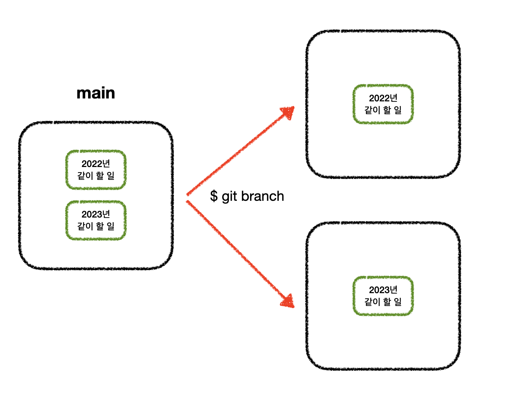

마치 가지를 뻗어 나가는 모양이죠?

실제로 영어 단어 브랜치(Branch)는 가지라는 뜻이 있습니다.

동일한 [README.md](./README.md) 파일을 관리한다고 하더라도 기존에 안정적인 버전은 놔두고 각자 2022년과 2023년을 나눠 작업하여 안정성은 물론 작업의 효율성까지 챙길 수 있게 됩니다.

이때 맨 처음 시작이 되는 브랜치, 다시 말해 모든 브랜치들의 부모 브랜치이자 마치 모든 가지들이 시작되는 기둥과 같은 브랜치가 바로 메인 브랜치입니다.

우리의 메인 브랜치는 단어 그대로 `main` 이라 이름지어졌지만 물론 다른 이름으로도 지을 수 있습니다.

관련해서 여담이지만 예전에는 `master` 라는 이름이 기본값이었는데 노예제도를 떠올리게 한다는 문제제기가 지속적으로 있었고 `main` 이라는 이름이 이제는 기본값이 되었습니다.

#### 첫 번째 가지를 뻗어봐요.

그러면 이제 첫 번째 가지를 뻗어볼까요?

우선 그전에 `git branch` 명령어를 통해 현재 어떤 브랜치들이 이 `.git` 디렉토리 내에 존재하는지 확인해봅시다.

```Bash
$ git branch
```

예상하셨던 것처럼 `main` 브랜치 하나 밖에 없습니다.

그러면 이제 `git branch 2022` 명령어를 통해 `2022` 라는 이름을 가진 브랜치를 하나 생성해줍시다.

그리고 `git checkout 2022` 명령어를 통해 현재 `main` 브랜치에 위치해있던 우리를 `2022` 브랜치로 이동합시다.

마치 호텔 체크아웃을 하듯 현재 내가 머물고 있던 방에서 다른 곳으로 이동한다고 생각하시면 편합니다.

```Bash
$ git branch 2022
$ git checkout 2022
```

이제는 앞서 작업한 내용을 기록했던 것과 똑같습니다.

2022년 할 일을 작업하기 위해 만든 `2022` 브랜치이기 때문에 2022년 할 일을 새로 추가하거나 수정해봅시다.

이때 유의할 점은 원격 저장소로 내가 한 작업물을 보낼 때 그 출처를 기존처럼 `main` 이 아닌 `2022` 해야 한다는 점입니다.

왜냐면 우리가 작업한 내용들은 `2022` 브랜치에서 진행한 것이고 여기서 작업한 것들을 원격 저장소로 보내고 싶기 때문이죠.

```Bash
$ git add README.md
$ git commit -m ":memo: 2022년 할 일 수정"
$ git push origin 2022
```

여기까지 완료했으면 이제 깃헙의 원격 저장소에 한 번 가볼까요?

본인이 포크한 원격 저장소로 가면 됩니다.

그러면 아래 이미지와 같이 이전에는 `main` 부분을 눌러보면 이전에는 없던 `2022` 브랜치가 생성된 것과 함께 `Compare & pull request` 버튼이 생성되어 있는 걸 확인할 수 있습니다.

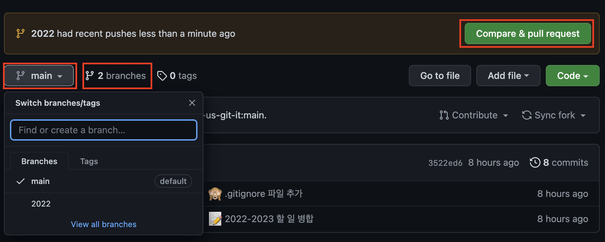

이제 `Compare & pull request` 버튼을 누르면 아래와 같은 화면을 볼 수 있습니다.

이때 유의할 점은 우리가 작업한 내용이 `base repository` 가 본인이 포크한 저장소여야 하고 또 `base:main` 브랜치로 향해야 한다는 것입니다.

`DSCHUFS/let-us-git-it` 으로 되어 있다면 그 아래 본인의 저장소로 변경해주세요.

우리가 현재 하려는 작업은 포크를 하기 전의 원본 저장소에 우리의 작업 내역을 반영시키려는 것이 아닌 포크를 한 뒤의 내 공간에 존재하는 원격 저장소에 작업 내역을 반영시키려는 것이기 때문입니다.

이후 `Create pull request` 버튼을 누릅니다.

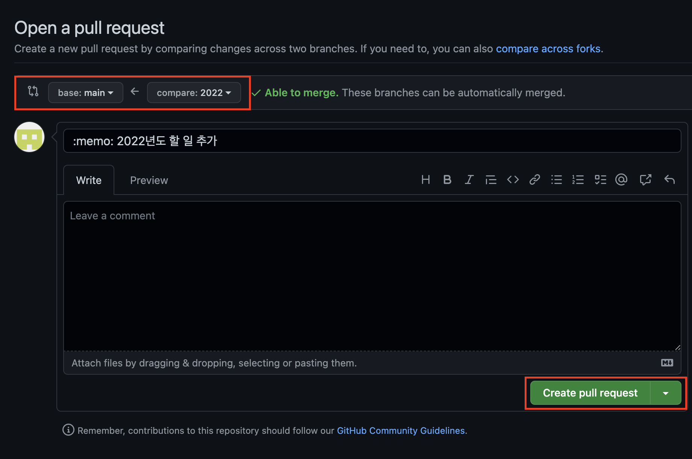

앞서 여러 버튼을 누르면서 아셨겠지만 `pull request` 라는 단어가 계속 반복되고 있습니다.

이처럼 로컬에서 작업한 내용을 원격 저장소에 반영해달라고 요청하는 작업을 **풀 리퀘스트(Pull Request)** 라 합니다.

우리가 앞서 `git push` 명령어로 작업 내용을 밀었죠?

그러면 원격 저장소 입장에서는 해당 작업을 당겨야 합니다.

그래서 당겨달라는 요청을 보내는 것이 바로 단어 그대로 풀 리퀘스트인 것입니다.

이렇게 풀 리퀘스트를 생성하면 아래 이미지와 같은 화면을 보실 수 있습니다.

생성한 풀 리퀘스트를 `Merge pull request` 버튼을 통해 `main` 브랜치에 합쳐줍니다.

이때 버튼의 종류를 보면 총 세 가지라는 걸 알 수 있는데요.

우리는 `Squash and merge` , `Rebase and merge` 버튼을 무시하고 `Create a merge commit` 버튼만 사용해보겠습니다.

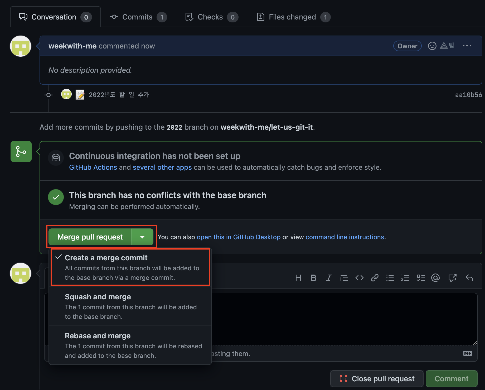

`Create a merge commit` 버튼을 누르면 아래 이미지와 같은 화면을 볼 수 있습니다.

이제 `Confirm merge` 버튼을 눌러 병합을 최종적으로 승인해줍니다.

**병합(Merge)** 이라는 건 회사 합병을 생각하면 편합니다.

A라는 회사가 B라는 회사를 인수합병한다는 기사를 본 적 있으신가요?

B라는 회사의 직원들이나 여러 기술들이 전부 A라는 회사에 흡수됩니다.

이처럼 깃에서의 병합 또한 서로 합치는 작업을 뜻합니다.

다시 말해 `2022` 브랜치에서 작업한 내용을 원격 저장소 `main` 브랜치에 합치는 겁니다.

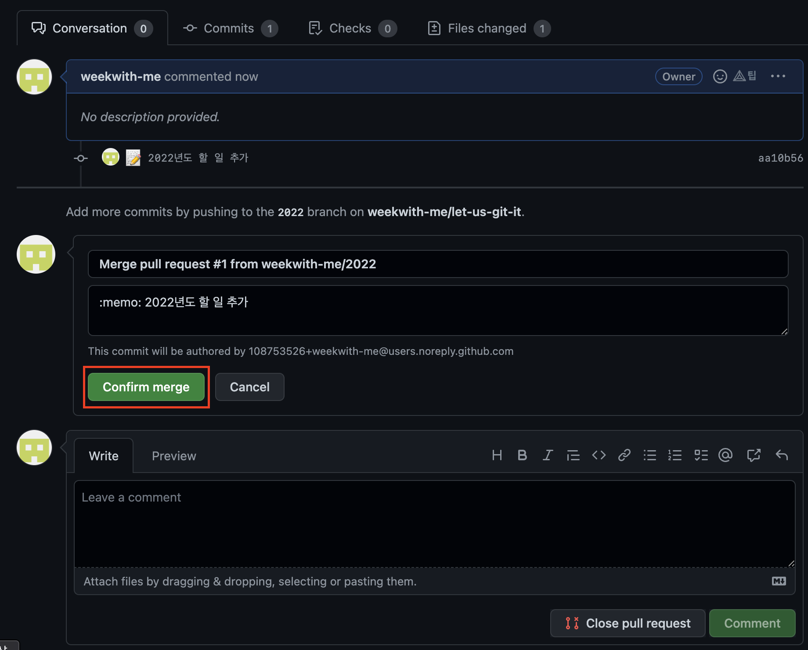

다시 원격 저장소의 메인 페이지로 넘어와 확인해보면 두 개의 커밋이 우리가 포크를 하기 전 저장소인 `DSCHUFS:main` 보다 앞서있다는 문장을 확인할 수 있습니다.

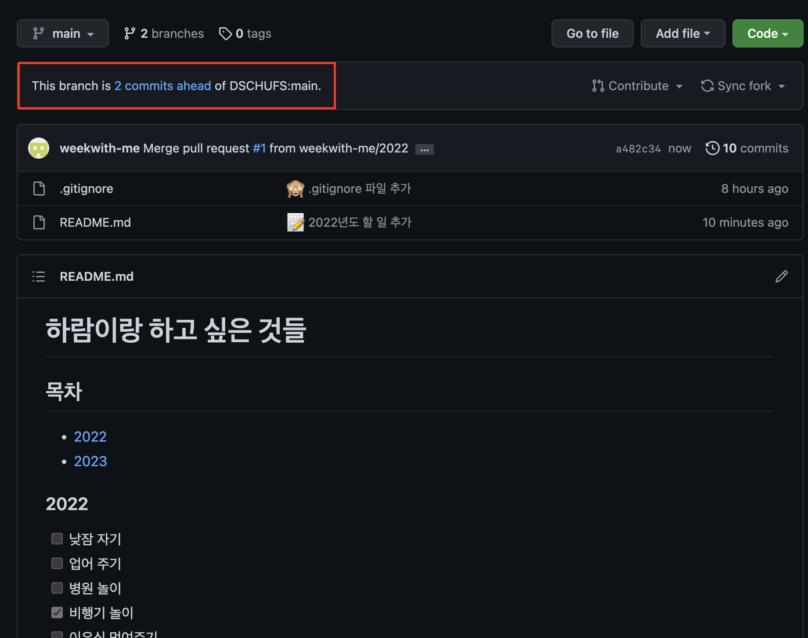

그러면 이제 우리의 로컬 브랜치 또한 합쳐진 내용을 반영해야겠죠?

`git checkout main` 명령어를 통해 기존 `2022` 브랜치에 있던 우리를 `main` 브랜치로 옮기고 `git pull origin main` 명령어를 통해 원격 저장소인 `origin` 에 기록되어 있는 내역을 `main` 브랜치로 당깁시다.

이때 `git pull` 명령어를 사용하기 전후로 `git log` 명령어를 사용해서 실제 내역에 어떤 차이가 발생했는지도 확인해봅시다.

```Bash
$ git checkout main
$ git log
$ git pull origin main
$ git log
```

두 개의 커밋만 한 번 확인해보면 아래와 같이 가장 최신의 커밋인 `HEAD` 부분과 `2022` 브랜치에서 작업한 내역 모두 잘 반영되어 있는 걸 알 수 있습니다.

그런데 문득 이런 의문이 들 수 있습니다.

커밋은 한 번만 했는데 왜 두 개의 커밋이 생긴거지?

이는 병합 또한 결국 하나의 작업이기 때문에 병합이라는 작업 내역을 기록하기 위해 커밋이 하나 늘어난 것입니다.

그래서 가장 최신의 커밋의 메세지를 보면 `Merge pull request` 라는 표현이 포함되어 있는 걸 알 수 있습니다.

이 표현은 우리가 앞서 풀 리퀘스트를 생성할 때 봤던 것과 동일한데 해당 표현 또한 풀 리퀘스트를 생성할 때 마음 대로 변경 가능합니다.

```
commit a482c34eb7506afe9d63373f95489761e8878c6b (HEAD -> main, origin/main, origin/HEAD)
Merge: 3522ed6 aa10b56
Author: weekwith-me <108753526+weekwith-me@users.noreply.github.com>
Date:   Mon Sep 26 10:21:28 2022 +0900

    Merge pull request #1 from weekwith-me/2022

    :memo: 2022년도 할 일 추가

commit aa10b563c368f878252029f6f2f0c444f377597f (origin/2022, 2022)
Author: 0417taehyun <leedobby@weekwith.me>
Date:   Mon Sep 26 10:11:25 2022 +0900

    :memo: 2022년도 할 일 추가
```

커밋이 하나 늘어났다는 건 다시 말해 `2022` 브랜치에도 늘어난 커밋 내역을 반영시켜야 한다는 의미입니다.

쉽게 병합을 했다는 사실까지는 `main` 브랜치가 알았는데 `2022` 브랜치는 아직 병합했다는 사실까지는 모르기 때문에 병합했다는 사실을 `2022` 브랜치에게 알려줘야 합니다.

`git checkout 2022` 명령어를 통해 `2022` 브랜치로 이동한 다음 `git merge __from__ __to__` 명령어를 통해 `main` 브랜치와 `2022` 브랜치를 병합해줍시다.

이때 `git merge` 명령어 전후로 앞서 했던 것과 같이 `git log` 명령어를 사용해서 실제 내역에 어떤 차이가 발생했는지도 확인해봅시다.

```Bash
$ git checkout 2022
$ git log
$ git merge main 2022
$ git log
```

`git merge` 명령어를 사용하기 이전 `git log` 명령어를 사용해서 내역을 확인해보면 아래와 같습니다.

아직 병합된 사실을 `2022` 브랜치가 알지 못합니다.

```
commit aa10b563c368f878252029f6f2f0c444f377597f (HEAD -> 2022, origin/2022)
Author: 0417taehyun <leedobby@weekwith.me>
Date:   Mon Sep 26 10:11:25 2022 +0900

    :memo: 2022년도 할 일 추가
```

이후 `git merge` 명령어를 사용하고 `git log` 명령어를 사용하면 아래와 같이 병합된 내역이 잘 반영되어 있는 걸 알 수 있습니다.

```
commit a482c34eb7506afe9d63373f95489761e8878c6b (HEAD -> 2022, origin/main, origin/HEAD, main)
Merge: 3522ed6 aa10b56
Author: weekwith-me <108753526+weekwith-me@users.noreply.github.com>
Date:   Mon Sep 26 10:21:28 2022 +0900

    Merge pull request #1 from weekwith-me/2022

    :memo: 2022년도 할 일 추가

commit aa10b563c368f878252029f6f2f0c444f377597f (origin/2022)
Author: 0417taehyun <leedobby@weekwith.me>
Date:   Mon Sep 26 10:11:25 2022 +0900

    :memo: 2022년도 할 일 추가
```

그런데 문득 이런 의문이 들 수도 있습니다.

`main` 브랜치를 안 거치고 `2022` 브랜치에서 바로 `git pull` 명령어를 사용하면 안 되는 건가?

아래와 같이 사용해도 괜찮습니다.

다만 이때 `main` 브랜치와 `2022` 브랜치의 작업 상태를 전부 최신화 해주기 위해 `main` 브랜치를 먼저 반영한 뒤에 `2022` 브랜치를 반영해준 것입니다.

`main` 브랜치는 모든 브랜치들의 시작점인 기둥이지만 `2022` 브랜치는 그런 메인 브랜치의 가지 중 하나입니다.

따라서 메인 브랜치에 최종적인 상태를 반영해둔뒤 이를 다른 가지들이 흡수하고 최신의 작업을 진행하는게 안정적이고 효율적입니다.

```Bash
$ git pull origin 2022
```

#### 4.2. 두 번째 가지를 뻗어봐요.

이번에는 앞선 방식과 다른 명령어로 브랜치를 생성해보겠습니다.

앞에서는 `git branch __branc_hname__` 명령어를 통해 브랜치를 생성하고 `git checkout __branch_name__` 명령어를 통해 해당 브랜치로 이동하였는데 이번에는 이를 한 번에 해볼까요?

`git checkout` 명령어 뒤에 `-b` 옵션을 붙이면 브랜치가 존재하지 않을 경우 생성해서 해당 브랜치로 이동합니다.

`2023` 이라는 브랜치를 하나 만들고 2023년 할 일 목록을 [README.md](./README.md) 파일에 추가하여 풀 리퀘스트를 생성해봅시다.

방법은 앞과 동일합니다.

```Bash
$ git checkout -b 2023

$ git add README.md
$ git commit -m ":memo: 2023년 할 일 추가"
$ git push origin 2023
```

풀 리퀘스트를 생성하고 원격 저장소에 반영했다면 이제 로컬에도 그 변경 내용을 다시 한 번 적용해줍시다.

```Bash
$ git checkout main
$ git pull origin main
```

#### 4.3. 작업을 하다 말았어요.

이제 다시 `2022` 브랜치로 한 번 이동해볼까요?

원래라면 `2023` 브랜치에 반영된 내용이 원격 저장소를 통해 `main` 브랜치에 반영되었고 이를 로컬에서도 바로 앞에서 `git pull origin main` 명령어를 통해 반영시켰으니 `2022` 브랜치에도 똑같이 반영시켜야 합니다.

그런데 이런 상황을 한 번 가정해볼까요?

누군가 2023년 할 일 목록을 `2023` 브랜치에서 열심히 작업하고 `main` 브랜치에도 반영했는데 내가 아직 반영하지 못한 상태에서 작업을 계속 하고 있다고 생각해봅시다.

어렵게 생각할 필요 없이 다른 사람이 피피티 10번째 장부터 쭉 작업한 뒤에 최종 파일에 미리 합쳐뒀는데 내가 아직 내 컴퓨터로 작업 중인 상황입니다.

이를 한 번 그림으로 표현해볼까요?

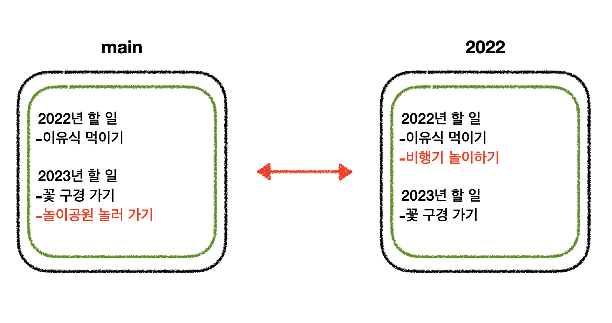

위 그림처럼 `main` 브랜치에는 `2023` 브랜치에서 작업한 내용이 들어가 있는데 `2022` 브랜치에는 그 내용이 전혀 반영되지 않은 채 계속 2022년에 할 일들을 추가하고 수정하고 있습니다.

그러면 `놀이공원 놀러 가기` 랑 `비행기 놀이하기` 가 서로 다른 상태죠?

상태가 다른 두 개를 갑자기 합쳐버릴 수는 없기 때문에 우선은 `2022` 브랜치에서 진행 중인 작업을 잠시 임시저장하고 `main` 브랜치에서 작업한 내역을 우선 병합하고 다시 재작업을 진행해보려 합니다.

우선은 이런 상황을 만들기 위해 `2022` 브랜치로 이동한 다음 [README.md](./README.md) 파일에 작성되어 있는 2022년에 할 일을 몇 가지 추가하고 수정해주세요.

```Bash
$ git checkout 2022

# 이후 README.md 파일 수정
```

그런 다음 `git stash` 명령어를 사용해서 현재 진행 중인 작업을 **임시저장** 해줍니다.

`git stash list` 명령어를 사용해 확인해보면 지금껏 임시저장한 것들을 한 눈에 목록으로 볼 수 있어요.

```Bash
$ git stash
$ git stash list
```

목록을 확인해보면 아래와 같은데 이전에 작성한 커밋 메세지와 함께 커밋 아이디가 기록되어 있는 것을 볼 수 있습니다.

그런데 단순히 이런 정보들로는 내가 어떤 작업을 하고 있었는지 알기 어렵겠죠?

```
stash@{0}: WIP on main: 3522ed6 :memo: 2022년 할 일 수정
```

그래서 이번에는 `git stash save` 명령어를 통해 메세지를 기록해봅시다.

다시 한 번 [README.md](./README.md) 파일에 2022년에 할 일을 몇 가지 추가하고 수정합시다.

그리고 `git stash svae` 명령어를 사용해서 이전 커밋 메세지를 기록했던 것과 동일하게 메세지를 기록합니다.

그리고 다시 한번 `git stash list` 명령어를 사용해 확인해봅시다.

```Bash
$ git stash save ":memo: 2022년 할 일 추가하는 작업 진행 중"
$ git stash list
```

이제 아래와 같이 우리가 작성한 메세지 내용이 정상적으로 반영된 것을 알 수 있습니다.

```
stash@{1}: WIP on main: :memo: 2022년 할 일 추가하는 작업 진행 중
stash@{0}: WIP on main: 3522ed6 :memo: 2022년 할 일 수정
```

그런데 특이한 점이 하나 보이지 않나요?

바로 `stash@{0}` 과 `stash@{1}` 입니다.

분명 앞서 메세지를 남기지 않아 이전 커밋 내용이 기록된게 제일 먼저 임시 저장한 내용인데 아래로 내려와 있고 가장 최신에 임시저장한 `stash@{1}` 이 제일 위에 올라와 있습니다.

혹시 가장 처음에 입력한게 가장 밑에 있는 구조, 어디서 많이 보지 않으셨나요?

바로 **스택(Stack)** 자료 구조입니다.

`git stash` 명령어를 활용해서 임시저장한 내역들은 아래 이미지와 같이 가장 최신의 내역이 제일 위에 쌓이는 구조입니다.

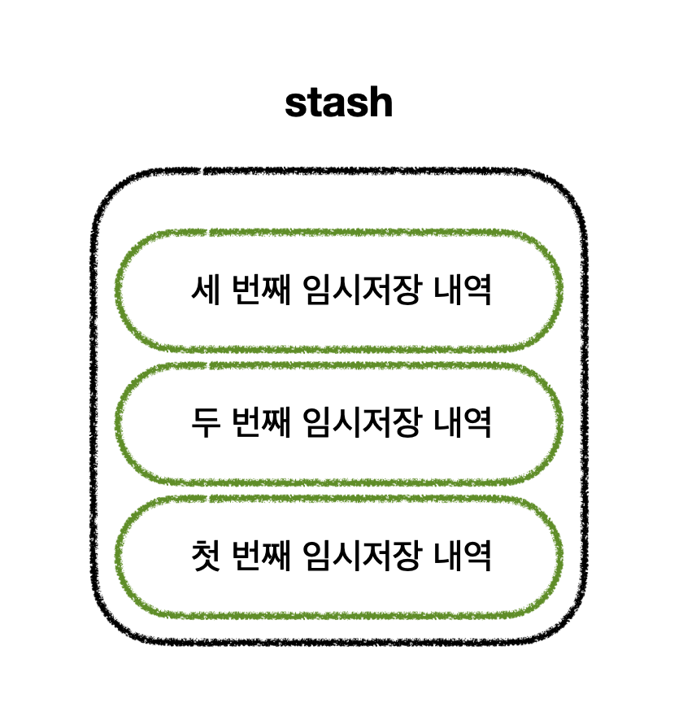

그래서 이제 `git stash apply` 명령어를 사용해 가장 최신의 임시저장 내역을 반영해봅시다.

이후 `git stash list` 명령어를 통해 확인해보면 아직 임시저장한 내역이 그대로 남아있는데 우리의 파일에는 반영된 것을 알 수 있습니다.

```Bash
$ git stash apply
$ git stash list
```

반영이 완료된 임시저장 내역을 지워주기 위해, 다시 말해 임시저장 스택에서 제거하기 위해 `git stash drop` 명령어를 사용해줍니다.

이후 `git stash list` 명령어를 통해 확인해보면 가장 최신의 임시저장 내역이 제거된 것을 알 수 있습니다.

```Bash
$ git stash drop
$ git stash list
```

물론 아래와 같이 조금 더 간단하게 명령어를 실행할 수도 있습니다.

`git stash apply` 명령어와 `git stash drop` 명령어를 합쳐서 사용할 수 있는 명령어가 바로 `git stash pop` 입니다.

단 임시저장한 내역을 적용하자마자 휘발된다는 점에 유의해야합니다.

```Bash
$ git stash pop
```

이제 다시 `git stash` 명령어를 통해 진행 중이던 작업을 임시저장하고 `main` 브랜치의 최신 상태를 `2022` 브랜치에 `git merge` 명령어를 활용해 병합해봅시다.

```Bash
$ git stash save ":memo: 2022년 할 일 추가하는 작업 진행 중"
$ git merge main 2022
```

이후 기존의 작업 중이어서 임시저장한 작업물을 `git stash pop` 명령어를 통해 적용시켜 봅시다.

```Bash
$ git stash pop
```

그러면 이상한 빨간 숫자가 등장한 것을 볼 수 있습니다.

#### 4.4. 어느 것을 고를까요.

작업 중이던 파일을 한 번 확인해볼까요?

그러면 아래 이미지와 같이 `Updated Upstream` 부분과 `Stashed Changes` 부분이 생긴 것을 알 수 있어요.

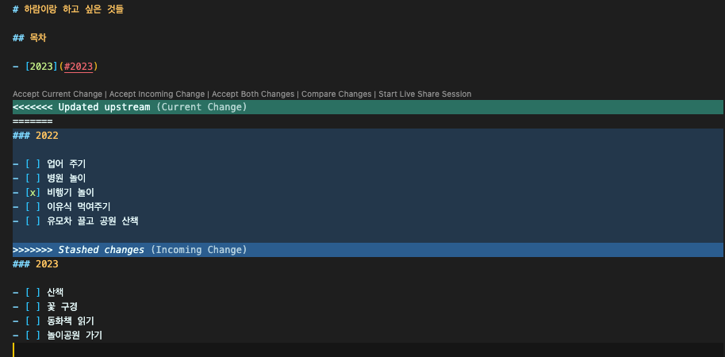

우리가 앞서 피피티 파일을 합치는 과정에서 이미지로 봤듯 서로 다른 내용이 있었던 것처럼 깃을 통해 병합을 하는 과정에서 서로 다른 내용이 생겨 어떤 것을 골라야할지 몰라 발생한 문제입니다.

이를 깃에서는 **충돌(Conflict)** 이라 합니다.

여러 통합 개발 환경 도구들은 이러한 충돌 상황에서 사용자가 쉽게 해결할 수 있게 위 이미지처럼 현재 어떤 최신의 변경사항이 반영되려 하고 사용자가 어떤 작업을 진행 중이었는지 비교해서 보여줍니다.

최신의 변경사항이 반영되려 한게 바로 `Updated upstream` 부분이고 사용자가 진행 중이던 작업이 바로 `Stashed changes` 입니다.

무엇을 선택할지는 결국 자유입니다.

둘 중 하나만을 선택할 수도 있고 둘 다 선택해서 반영할 수도 있습니다.

실제로 풀 리퀘스트를 하는 상황에서도 아래 이미지와 같이 충돌이 발생한 상태라 병합 버튼을 클릭하지 못하게 막힌 경우도 많습니다.

위 상황에서도 로컬에서 병합 과정을 거치지 않고 풀 리퀘스트를 했다면 아래와 같은 이미지를 마주했을 것입니다.

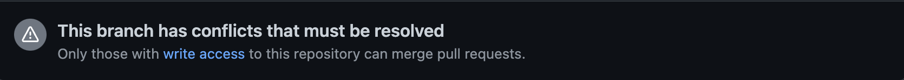

우리는 오늘 임의적으로 `git stash` 명령어를 활용해서 출동 상황을 만들고 이를 해결해보았지만 실제 협업하는 과정에서는 훨씬 빈번하게 충돌이 발생합니다.

그때 너무 두려워하지 말고 작업 중이던 걸 임시저장도 해보고 커밋 아이디를 비교하거나 커밋 메세지를 확인해보면서 하나씩 해결해봅시다!

### 5. 함께 더 잘 일해보고 싶어요.

축하드립니다!

여러분들은 오늘 깃과 깃헙에 한 걸음 더 가까워졌습니다.

이외에도 사실 정말 많은 기능들과 방법들이 존재하지만 오늘 배운 내용들을 토대로도 어느 정도 협업이 가능할 것입니다.

그래도 몇 가지 드는 의문들이 있는데 조금만 더 살펴보고 갈까요?

#### 5.1. 중요한 파일은 못 올리게 해요.

한 번 메인 브랜치에서 `SECRET.txt` 파일을 생성하고 그곳에 `0417` 을 작성해봅시다.

(4월 17일은 제 생일이고 매우 중요하니 잘 다뤄주세요 :stuck_out_tongue_closed_eyes:)

실수로 올리면 안 되는 파일인데 `git add` 그리고 `git commit` 명령어를 사용해서 모르고 원격 저장소에 올려버린 경우라면 어떻게 해야할까요?

우선 원격 저장소에 있는 걸 삭제 해야 합니다.

이는 `git rm --cached __filename__` 명령어를 통해 가능합니다.

이후 `git add` 명령어를 사용했을 때와 동일하게 `git commit` 명령어를 사용해서 해당 작업 내역을 기록하고 `git push` 명령어를 사용해 이를 원격 저장소에 반영해줍니다.

```Bash
$ git rm --cached SECRET.txt
$ git commit -m ":memo: SECRET.txt 파일 삭제"
$ git push origin main
```

이때 `--cached` 옵션이 붙을 경우 원격 저장소에만 해당 파일을 삭제시키는 명령어고 `--cached` 명령어 없이 단순히 `git rm` 명령어만 사용할 경우 로컬과 원격 저장소 모두 삭제하는 방법입니다.

이렇게 원격 저장소에서 삭제를 했으면 앞으로도 실수로 올리는 경우가 없게 해야겠죠?

이때 활용하는게 바로 `.gitignore` 파일입니다.

`.gitignore` 파일을 하나 만들어주고 그곳에 `SECRET.txt` 파일을 입력한뒤 저장하면 `.git` 디렉토리에서 자동으로 해당 파일은 추적 대상에서 제외시켜 업로드 자체가 안 되게 합니다.

`SECRET.txt` 파일 외에도 업로드하면 안 되는 다양한 파일들이 존재합니다.

관련해서는 [gitignore.io](https://www.toptal.com/developers/gitignore/) 홈페이지를 방문해서 Java, Python 등 직접 본인이 사용하는 언어부터 여러 가지 것들을 입력해보며 확인해보길 바랍니다.

그런데 문제가 생겼습니다.

`git log` 명령어를 통해 확인해보니 추가된 내역과 삭제된 내역이 그대로 있네요.

이게 무엇을 의미하는 거냐고요?

```
commit fca75fbba0cf83004407377e18e21765e0c50213 (HEAD -> main, origin/main)
Author: 0417taehyun <0417taehyun@gmail.com>
Date:   Mon Sep 26 12:07:48 2022 +0900

    :memo: SECRET.txt 파일 삭제

commit 986f5facf5aeb59b1c368ffd39e9c0f6a346bb97
Author: 0417taehyun <0417taehyun@gmail.com>
Date:   Mon Sep 26 12:06:31 2022 +0900

    :memo: SECRET.txt 파일 추가
```

원격 저장소에 가면 아래 이미지와 같이 이전 커밋 내역들을 확인할 수 있습니다.

표시한 `commits` 부분을 클릭해서 한 번 확인해볼까요?

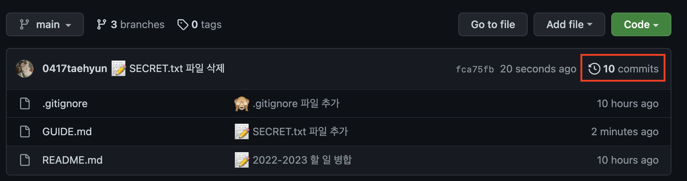

그 중에서도 가장 최신의 파일을 삭제한 내역을 `Load Diff` 버튼을 눌러 확인해봅시다.

그러면 아래 이미지와 같이 우리가 삭제한 내용이 그대로 보여지는 것을 알 수 있습니다.

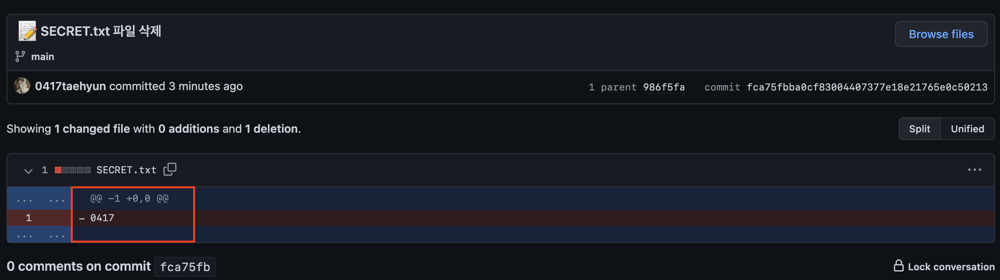

외부에 공개되면 안 되기 때문에 삭제했는데 그 삭제한 내역까지도 투명하게 공개가 되네요.

그렇다면 이럴 때 과연 어떻게 해야 할까요?

커밋 자체를 되돌려야 합니다.

커밋을 수정하고 되돌리는 방법은 여러 가지가 있지만 오늘은 `git reset` 명령어를 사용해보겠습니다.

`git reset` 명령어에 `--soft` 옵션을 추가하면 작업 내용은 그대로 놔두고 커밋 내역만 완전히 없앨 수 있습니다.

여기서 작업 내용을 그대로 둔다는 의미는 스테이징 영역에 둔다는 의미입니다.

반대로 `--hard` 옵션을 추가할 경우 커밋 내역은 물론 작업 내역까지도 없애게 됩니다.

이후 `HEAD~2` 매개변수를 전달하여 가장 최신 커밋을 의미하는 `HEAD` 기준으로 이전 두 개의 커밋까지 없애겠다는 의미를 컴퓨터에게 전달합니다.

결론적으로 `git reset --soft HEAD~2` 명령어를 통해 가장 최신의 커밋 기준 두 개의 커밋을 없애고 작업 내역 자체는 로컬에는 그대로 둡니다.

이후 `git push` 명령어를 통해 해당 작업 내역을 원격 저장소에 반영시키는데 이때 `--force` 옵션을 추가합니다.

원격 저장소와 로컬 저장소의 커밋이 다르기 때문에 강제로 로컬의 사항을 원격 저장소에 반영시키기 위해서입니다.

이후 `git log` 명령어를 통해 실제로 해당 커밋 자체가 사라졌는지 확인합니다.

```Bash
$ git reset --soft HEAD~2
$ git push origin main --force
$ git log
```

원격 저장소에서 확인해보면 기존 커밋 개수보다 두 개가 줄어든 것을 아래 이미지와 같이 확인할 수 있습니다.

또한 커밋 내역을 들어가서 확인해봐도 이전 `SECRET.txt` 파일과 관련된 커밋은 완전히 없어진 것을 알 수 있죠.

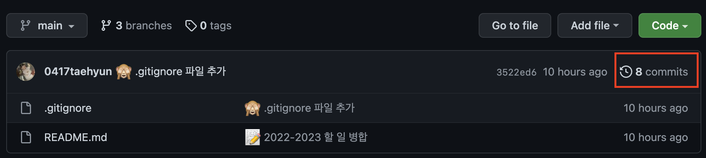

`git reset` 명령어 외에도 `git revert` 등 다양한 명령어 또한 존재합니다.

간단하게만 둘의 차이를 말씀드리면 `git reset` 명령어의 경우 커밋 히스토리, 다시 말해 지금껏 작성해왔던 커밋 내역 자체를 삭제시키고 변경시킵니다.

반대로 `git revert` 명령어의 경우 커밋 히스토리는 유지한채 새로운 커밋으로 이전의 작업 내역을 수정할 수 있습니다.

무엇을 사용할지는 상황에 따라 다릅니다.

관련해서는 더 추가적으로 알아보며 공부하길 추천합니다.

#### 5.2. 너무 많은 사람이 같이 일해요.

브랜치를 사용한다고 하더라도 너무 많은 사람이 함께 일하는 경우가 있습니다.

그렇다면 브랜치를 어떻게 나누어야 할까요?

막상 대답하려니 쉽지 않습니다.

다행히도 이러한 의문을 가진 엔지니어들이 무척 많았고 여러 가지 전략이 등장했습니다.

이걸 보통 **깃 브랜치 전략(Git Branch Strategy)** 라고 부릅니다.

여러 방법이 있지만 그중에서도 가장 대표적인게 **깃 플로우(Git Flow)** 입니다.

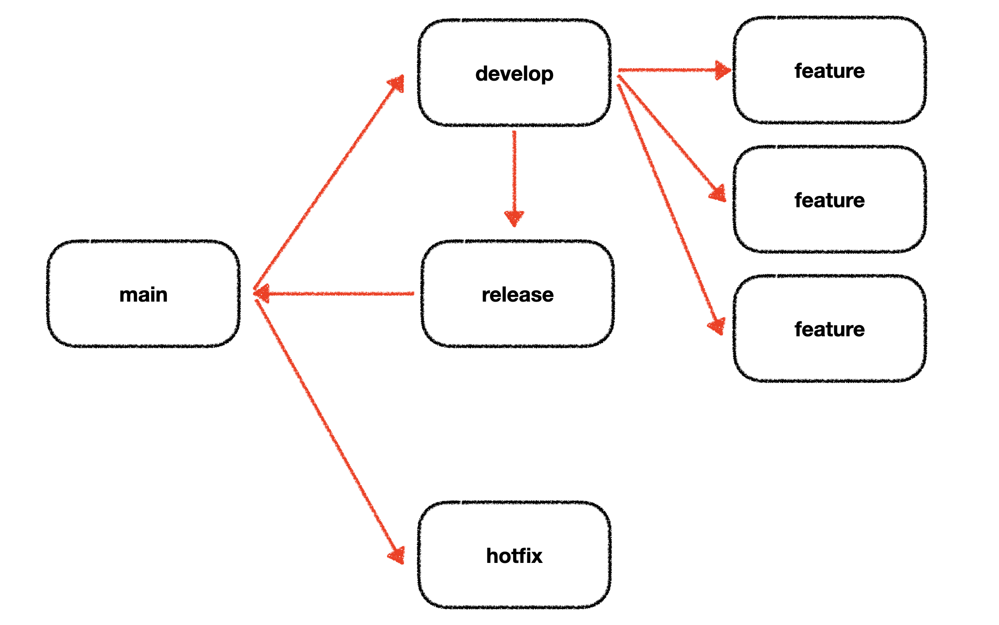

대략적인 그림은 위와 같습니다.

`main` 브랜치를 기준으로 작업 내용들만을 관리할 `develop` 브랜치를 생성하고 해당 `develop` 브랜치를 기준으로 여러 작업 별로 `feature` 브랜치를 만듭니다.

예를 들면 로그인만 관리하는 `feature/sign-in` , 게시글만 관리하는 `feature/post` 와 같습니다.

해당 `feature` 브랜치들에서 작업해서 이상이 없는 경우 `develop` 브랜치로 병합됩니다.

그렇게 각자가 맡은 작업들을 완료해서 이상 없이 `develop` 브랜치에 병합되면 이를 실제 서비스에 반영하기 위해 `release` 브랜치를 생성합니다.

이때 유의할 점은 `release` 브랜치는 `develop` 브랜치를 기준으로 한다는 점입니다.

이후 실제 서비스 반영이 끝나면 해당 `release` 브랜치에 적용된 내용들을 `main` 브랜치에 적용시켜 둡니다.

그런데 한치 앞도 모르는게 인생이라고 서비스를 이용하다보면 예상하지 못한 오류가 발생하여 급하게 고쳐야 하는 경우도 생깁니다.

이를 다루기 위해서 `main` 브랜치 기준으로 `hotfix` 브랜치를 만들고 오류 수정만을 위해 해당 브랜치를 사용한 뒤 오류 수정 작업을 마치면 그 결과를 `main` 브랜치 및 `develop` 브랜치에 적용시킵니다.

이러한 흐름이 깃 플로우의 핵심입니다.

그렇다면 이렇게 작업을 했을 때의 장점은 무엇일까요?

무엇보다 각 기능별로 효율적인 작업이 가능해지고 서비스의 안정성이 향상됩니다.

심각한 오류가 발생하더라도 언제든 이전 버전으로 `release` 브랜치를 활용해 되돌릴 수 있으며 `hotfix` 브랜치를 사용하여 급하게 수정도 가능합니다.

이외에도 정말 많은 전략들이 존재합니다.

엔지니어링 회사에서 운영하는 기술 블로그를 보다보면 각 팀 마다 어떤 전략을 고민하고 어떻게 본인들의 상황에 맞춰 적용시켰는지 알 수 있는데요.

관련해서 여러 가지 글들을 찾아보며 읽어보길 추천드립니다.

#### 5.3. 엔지니어들은 게을러요.

엔지니어들은 게으릅니다.

반복문을 배울 때 이런 비유를 들어본 적 있으신가요?

1부터 100까지 100번의 덧셈 연산을 써서 구하는게 귀찮아서 반복문을 사용한다.

이처럼 엔지니어링 기술은 단순 반복 작업을 효율적이게 만들어주기 위해 존재하기도 합니다.

깃과 깃헙에서도 마찬가자입니다.

깃과 깃헙을 사용하는 결정적인 이유는 결국 무엇인가요?

협업입니다.

그런데 조금 더 구체적으로 생각해볼까요?

우리는 협업을 왜 해야하는 걸까요?

어떤 제품 또는 서비스를 만들기 위해 협업합니다.

예를 들어 학교 홈페이지를 만든다고 하더라도 몇 명의 인원이 함께 작업을 하게 되고 그 과정에서 버전 관리를 하며 협업을 잘 하기 위해 우리는 깃과 깃헙을 사용합니다.

결국 핵심은 깃과 깃헙을 사용해서 제품과 서비스를 잘 만드는데 있습니다.

생각해보면 간단합니다.

깃을 통해 버전을 관리하고 깃헙에 업로드한 소스 코드는 결국 최종본과 같습니다.

메인 브랜치는 앞서 이야기했던 것처럼 각자가 작업한 내용을 합쳐놓은 나무의 줄기와도 같은 역할이니까요.

그렇다면 이렇게 생각해볼 수도 있습니다.

결국 최종본 파일을 어딘가에 배포해야 우리 서비스를 작동시킬 수 있겠다!

여러분의 컴퓨터도 여러분이 만든 홈페이지를 작동시킬 서버가 될 수 있습니다.

하지만 24시간 언제나 안정적으로 켜져 있으리란 보장이 없죠.

간혹 물을 쏟아 고장이 날 수도 있고 고양이가 잘못 건들여서 꺼질 수도 있고 무엇보다 전기료 감당이 될지 걱정입니다.

그래서 보통 서버 컴퓨터를 따로 두곤 합니다.

심지어 요즘에는 직접 서버 컴퓨터를 따로 구비해서 운영하는게 아닌 마치 깃을 함께 쓰기 위해 깃헙이라는 호스팅 플랫폼을 쓰는 것처럼 여러 클라우드 호스팅 서비스를 사용해서 해당 서버를 원거리에서 빌려다가 씁니다.

관련된 내용을 이곳에 다 할애하기에는 무리가 있으니 결론적으로 작업한 결과물이 24시간 안정적인 운영이 가능한 서버에 배포되어야 한다는 것까지만 이해해주세요.

그렇다면 그 서버에 우리의 소스 코드를 어떻게 옮길 수 있을까요?

우리가 앞서 `git clone` 등의 명령어를 사용했던 것처럼 서버에 접속해서 소스 코드를 복제하고 `git pull` 명령어를 사용해서 매번 변경사항이 있을 때마다 적용시켜야 할까요?

앞서 1부터 100까지 더하는게 귀찮아 반복문을 만들었던 우리 엔지니어들의 성향을 생각해보면 이런 비효율성을 가만히 보고만 있지는 않았을 것 같습니다.

이런 안정적인 통합과 배포를 위해 등장한게 바로 **지속적 통합(Continuous Integration)**과 **지속적 배포(Continuous Deploy)** 를 뜻하는 **CI/CD** 입니다.

여담이지만 조금 더 정확하게는 지속적 배포 과정에 **지속적 제공(Continous Delivery)** 이라는 의미 또한 내포되어야 합니다.

각설하고, 빌드와 테스트를 자동화시켜 안정적인 소스 코드를 유지할 수 있게 하고 이를 자동으로 배포하게 하는게 바로 CI/CD입니다.

그리고 이를 도와주는 여러 서비스들 중 하나가 바로 깃헙 내에 있는 **GitHub Actions**입니다.

이 과정을 간략하게 도식화해보면 아래 이미지와 같습니다.

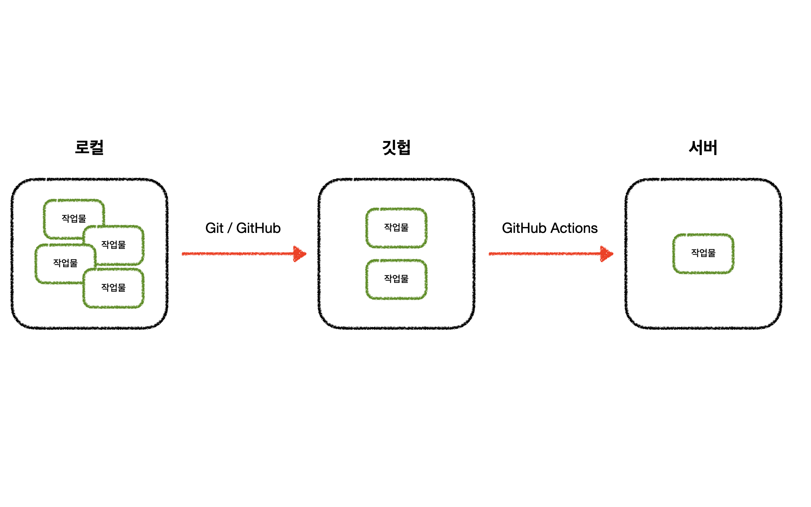

`.github` 디렉토리 내에 `workflows` 라는 디렉토리를 만들고 그 내부에 `yaml` 파일을 만들어서 사용 가능합니다.

더 자세한 내용은 이곳에서 다루지 않을 테니 궁금하신 분들은 추가적으로 찾아보길 추천드립니다.

### 6. 결론

결론적으로 깃과 깃헙은 협업과 함께 버전 관리를 도와주는 도구이자 서비스이지만 동시에 협업과 버전 관리의 필요성의 바탕이 되는, 다시 말해 협업과 버전 관리를 해야 하는 본질적인 이유인 좋은 제품과 서비스를 만드는데 도움이 되는 여러 생산성을 제공하는 도구이자 서비스라 생각하면 좋습니다.

현재 이 글은 2022년 9월 26일 월요일에 작성이 마무리 되었습니다. 빠르게 변화해가는 소프트웨어 엔지니어링 세계에서 이 글 속에 있는 내용이 틀릴 수도 있습니다.

관련해서 언제나 편하게 피드백 주시면 감사하겠습니다.

긴 글 읽어주셔서 감사드리며 조금이라도 이 글이 깃과 깃헙에 입문하는데 도움이 되었으면 합니다.

감사합니다.
